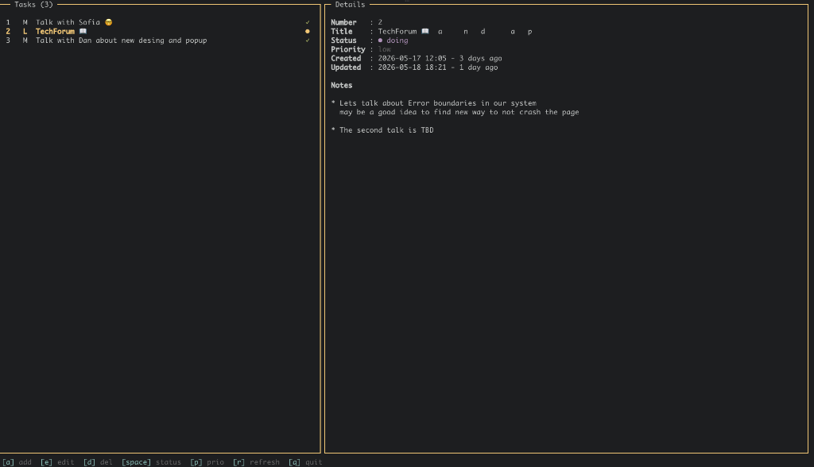
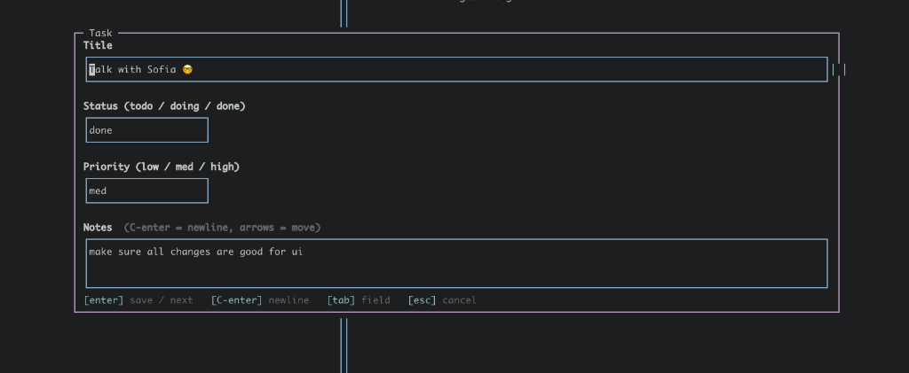

# ttm - Terminal Task Manager

Terminal task manager with a lazygit-style UI.

<p align="center">
 <div> </div>
<div>  </div>
</p>

Built with **Node.js** — plain JavaScript, no TypeScript, no classes, single runtime dependency (`neo-blessed`). Tests run on Node's built-in `node:test` runner; formatting via Prettier.

## Install

```sh
npm install
```

Requires Node.js >= 18.

## Run

```sh
node bin/ttm.js
# or, after `npm link`:
ttm
```

## Version

Current version: **0.0.1b** (pre-release).

Check the installed version from the CLI:

```sh
ttm --version       # after `npm link`
node bin/ttm.js -v  # without linking
npm run version:show
# → ttm 0.0.1b
```

The version is stored in `package.json` (as the semver-valid `0.0.1-b`) and re-exported in display form from `src/version.js` — bump it in one place and the CLI flag, screen title, and `npm` metadata all stay in sync.

## Layout

```
┌─ Tasks ────────────┬─ Details ──────────────┐
│ 1   H  Buy bread ○ │ Title    : Buy bread   │
│ 2   M  Refactor  ● │ Status   : ● doing     │
│ 3   L  Pay bill  ✓ │ Priority : high        │
│                    │ ...                    │
└────────────────────┴────────────────────────┘
 [a] add  [e] edit  [d] del  [space] status  [p] prio  [q] quit
```

## Default hotkeys

| Key           | Action                               |
| ------------- | ------------------------------------ |
| `j` / `↓`     | Move down                            |
| `k` / `↑`     | Move up                              |
| `a`           | Add task                             |
| `e` / `enter` | Edit selected task                   |
| `d` / `x`     | Delete selected task (with confirm)  |
| `space`       | Cycle status (todo → doing → done)   |
| `p`           | Cycle priority (low → med → high)    |
| `r`           | Refresh — reload tasks from disk     |
| `q`           | Quit                                 |
| `Ctrl-C`      | Force quit (works inside modals too) |

Inside the edit dialog:

| Key      | Action              |
| -------- | ------------------- |
| `enter`  | Next field / submit |
| `Ctrl-S` | Save                |
| `esc`    | Cancel              |

## Configuration

Built-in defaults live in `config/`. To override, drop JSON files in `~/.ttm/`:

- `~/.ttm/theme.json` — colors and styles (deep-merged over `config/default-theme.json`)
- `~/.ttm/keys.json` — action → keys mapping (deep-merged over `config/default-keys.json`)

Example `~/.ttm/keys.json`:

```json
{
  "delete": ["D"],
  "cyclePriority": ["P", "."]
}
```

Example `~/.ttm/theme.json`:

```json
{
  "borderFocused": { "fg": "green" },
  "selected": { "fg": "magenta", "bold": true },
  "status": {
    "doing": "cyan"
  },
  "statusIcon": {
    "todo": "[ ]",
    "doing": "...",
    "done": "[x]"
  }
}
```

Status icons accept any string (`○`/`●`/`✓` are the defaults). Use the per-status color from `theme.status.*`.

## Storage

Tasks are persisted to `~/.ttm/tasks.json` as a plain JSON array. Writes are atomic (`tasks.json.tmp` → rename).

Task shape:

```json
{
  "id": "uuid",
  "title": "string",
  "status": "todo | doing | done",
  "priority": "low | med | high",
  "notes": "string",
  "createdAt": "ISO 8601",
  "updatedAt": "ISO 8601"
}
```

## Project layout

```
ttm/
├── bin/ttm.js                    entry point
├── config/
│   ├── default-theme.json
│   └── default-keys.json
└── src/
    ├── App.js                    createApp() — orchestrates everything
    ├── config/
    │   ├── ConfigLoader.js       load(name) merges defaults + user overrides
    │   ├── Theme.js              createTheme()
    │   └── Keybindings.js        createKeybindings()
    ├── domain/Task.js            createTask, updateTask, nextStatus, nextPriority
    ├── storage/JsonTaskStore.js  createJsonTaskStore()
    └── ui/
        ├── TaskListPanel.js
        ├── DetailPanel.js
        ├── HelpBar.js
        ├── EditDialog.js
        └── ConfirmDialog.js
```

Every module exports factory functions returning plain objects of methods. No classes, no `this`, no inheritance — state lives in closures.

## License

MIT
